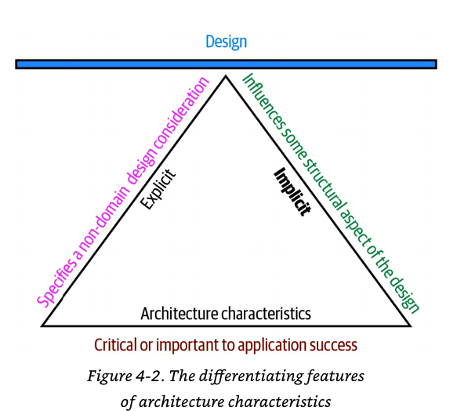

# Архитектурные характеристики

Характеристика архитектуры соответствует трем критериям:
 
* Указывает на недоменную конструкцию
* Влияет на некоторые структурные аспекты дизайна
* Критично или важно для успеха приложения
 
Эти взаимосвязанные определения проиллюстрированы:

### Проблема домена

* **Слияния и поглощение** - функциональная совместимость, масштабируемость, адаптируемость, расширяемость
* **Время выхода на рынок** - гибкость, тестируемость, возможность развертывания
* **Удовлетворенность пользователей** - производительность, доступность, отказоустойчивость, тестируемость,
возможность развертывания, agility, безопасность
* **Конкурентное преимущество** - гибкость, тестируемость, развертываемость, масштабируемость,
доступность, отказоустойчивость
* **Время и бюджет** - простота, осуществимость
