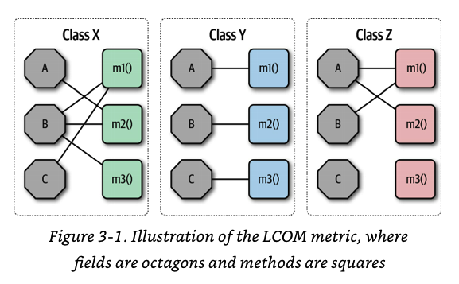

# Modularity

The dictionary defines module as “each of a set of standardized parts or 
independent units that can be used to construct a more complex structure.” 
We use modularity to describe a logical grouping of related code, which could 
be a group of classes in an object-oriented language or functions in a 
structured or functional language. Most languages provide mechanisms
for modularity (package in Java, namespace in .NET, and so on). 
Developers typically use modules as a way to group related code together. 
For example, the com.mycompany.customer package in Java should contain
things related to customers.

If an architect designs a system without paying attention to how the 
**pieces wire together**, they end up creating a system that presents myriad difficulties.
         
Richards, Mark; Ford, Neal. Fundamentals of Software Architecture . O'Reilly Media. Kindle Edition.

### Cohesion

* [LCOM metric](https://stackoverflow.com/questions/25720061/how-to-get-lcomlack-of-cohesion-of-methods-metric-in-sonarqube-4-2)

### Coupling

### Connascence

* Minimize overall connascence by breaking the system into encapsulated elements
* Minimize any remaining connascence that crosses encapsulation boundaries
* Maximize the connascence within encapsulation boundaries